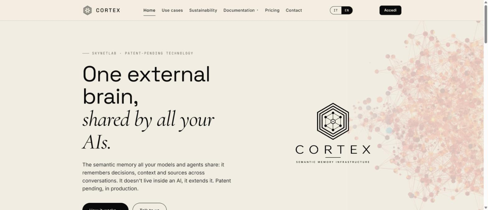

# Cortex — Semantic Memory for AI Agents

> One external brain, model-agnostic, in production. Connect it to Claude in two minutes — free trial, no credit card.

**Cortex** is a patent-protected semantic memory infrastructure developed by [SKYNETLAB](https://skynetlab.net/) (Bergamo, Italy). Connected to your AI assistant as a remote MCP connector, it lets your conversations **save decisions, context and sources — and find them again in every later session**. Your AI remembers, and can show *why* it remembers.

🌐 Website: [skynetlab-cortex.com](https://skynetlab-cortex.com/) · 📄 [Patent](https://skynetlab-cortex.com/brevetto) · 📊 [Benchmark](https://skynetlab-cortex.com/benchmark) · 📚 [Paper](https://skynetlab-cortex.com/paper) · 💶 [Pricing](https://skynetlab-cortex.com/abbonamenti)

> 🇮🇹 Versione italiana: [README.it.md](README.it.md)



---

## Why Cortex is not "just another memory plugin"

Most memory tools for AI agents record what the agent did and retrieve similar text later. Cortex models **what is true and how reliable it is**:

| Capability | What it means |
|---|---|
| **Quality Gate on write** | Every memory passes a novelty/redundancy check before being stored. No junk accumulation. |
| **Typed claims & conflict tracking** | Facts are extracted as claims; contradictions between memories are detected and tracked, not silently overwritten. |
| **Knowledge graph** | Memories are linked by entities and typed relations, not just vector similarity. |
| **Coherence metric (Ψ_C)** | Each memory carries a native coherence score — the system knows how well a memory fits what it already knows. |
| **Memory consolidation ("REM")** | A continuous background cycle consolidates episodic memories into long-term knowledge. |
| **Transparent evidence** | Answers can cite the memories and sources they come from. |

Cortex runs on globally distributed edge infrastructure operated in the **European Union**. The memory engine is covered by Italian patent application **UIBM 102026000014026** (filed 15 May 2026).

## Quick start — Claude (web / desktop / mobile)

Requirements: a Claude plan that supports custom connectors (the "Connectors" entry appears in Settings). No Cortex account needed beforehand — it is created on first sign-in.

1. In Claude open **Settings → Connectors → Add custom connector**
2. Paste this URL and confirm:

   ```
   https://skynetlab-cortex-saas-mcp.cortex-320.workers.dev/mcp
   ```

3. Authorize access on the Cortex consent page (Google or email sign-in). Your personal memory space is created automatically, isolated from every other user.

That's it. Talk to Claude as usual: *"Remember that we chose supplier X"*, *"what did we decide about the budget?"*, *"show me the sources for this claim"*. Claude picks the right tool on its own.

## Quick start — Claude Code

```bash
claude mcp add --transport http cortex https://skynetlab-cortex-saas-mcp.cortex-320.workers.dev/mcp
```

Then authenticate when prompted (`/mcp` shows connection status).

## Quick start — other MCP clients (stdio bridge)

For MCP clients that don't support remote connectors natively, use the [`mcp-remote`](https://www.npmjs.com/package/mcp-remote) bridge. Example configuration (see [`examples/`](examples/)):

```json
{
  "mcpServers": {
    "cortex": {
      "command": "npx",
      "args": ["-y", "mcp-remote", "https://skynetlab-cortex-saas-mcp.cortex-320.workers.dev/mcp"]
    }
  }
}
```

## The six tools

| Tool | Type | Description |
|---|---|---|
| **Search memories** | read | Semantic search across your memories |
| **Fetch memory** | read | Full detail of one memory, with its sources |
| **Recall & synthesize** | read | Narrative synthesis of what Cortex knows about a topic |
| **Show conflicts** | read | Tracked contradictions between memories |
| **Save memory** | write | Stores a memory — after a quality check against duplicates and redundancy |
| **Forget memory** | destructive | Deletes a memory — always with explicit confirmation |

## Data & privacy

Memories are personal: each user only sees their own. They are exportable and deletable on request, and the infrastructure operates in the European Union. Details: [Privacy Policy](https://skynetlab-cortex.com/privacy).

To disconnect, simply remove the connector from your client's settings; your memories remain in your Cortex account until you request their deletion.

## Is this open source?

The Cortex memory engine is a **hosted, patent-protected service** — its source code is not published. This repository contains the public documentation and client-side configuration examples for connecting to it. Everything in this repository is released under the [MIT License](LICENSE).

## Support

📧 info@skynetlab.net · [Contact page](https://skynetlab-cortex.com/contatti)

---

*Cortex is a [SKYNETLAB](https://skynetlab.net/) product — independent research lab & deeptech studio, Bergamo, Italy. Founder: Filippo Pilotta ([ORCID 0009-0000-5002-4199](https://orcid.org/0009-0000-5002-4199)).*

*Some content and product outputs are generated or assisted by artificial intelligence, pursuant to Art. 50 of Reg. (EU) 2024/1689. [AI transparency](https://skynetlab-cortex.com/trasparenza-ai).*
